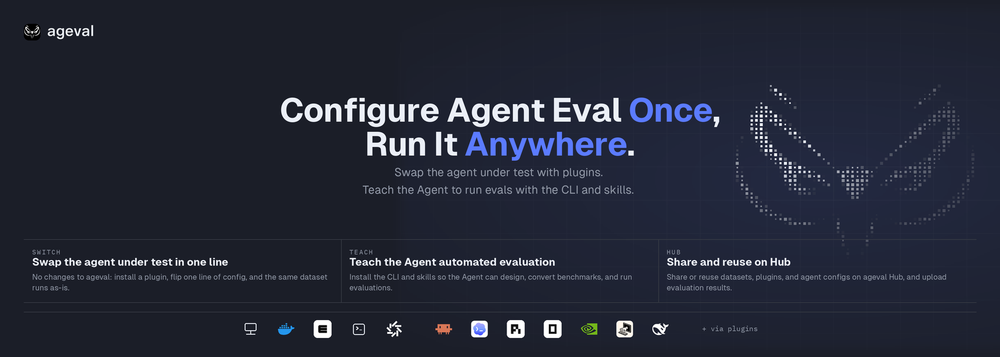
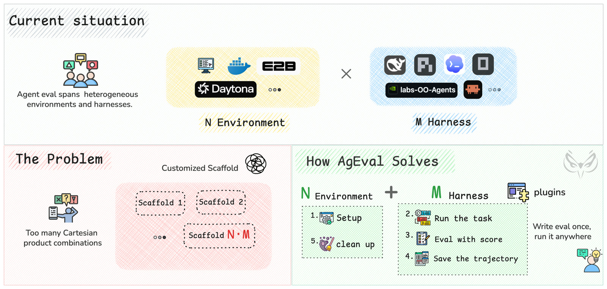

# ageval

<p align="center">
  
</p>

<p align="center">
  <a href="README.md">English</a> · <a href="README.zh-CN.md">中文</a>
</p>

<p align="center">
  <a href="https://github.com/ZJU-REAL/ageval/stargazers"></a>
  <a href="https://github.com/ZJU-REAL/ageval/blob/main/LICENSE"></a>
  <a href="https://github.com/ZJU-REAL/ageval/releases"></a>
  <a href="https://github.com/ZJU-REAL/ageval/commits"></a>
</p>

Most agent evaluation still measures the **model**: same prompts, same tool contract, different weights or APIs. A shippable agent is a model plus its runtime — the same weights on a different coding agent, tool policy, or environment behave differently and cost differently. A comparison that deserves the name is a product: **H agent runtimes × M models × E environments**. Every cell wants its own scaffold; scores mean nothing unless that cell is in the lock.

**ageval** switches the agent under test with plugins on one running base; install the CLI and skills so the Agent can design, convert, and run benchmarks; share or reuse datasets, plugins, and agent configs on Hub, and upload results.

<p align="center">
  
</p>

## Contents

- [What it is](#what-it-is)
- [How it works](#how-it-works)
- [Features](#features)
- [Getting started](#getting-started)
- [Architecture](#architecture)
- [Project structure](#project-structure)
- [Docs](#docs)

## What it is

- **Switch the agent under test.** Environments and agent runtimes arrive as plugins — ACP by default ([pi](https://pi.dev), [Codex](https://github.com/openai/codex), [Claude Code](https://github.com/anthropics/claude-code), [OpenCode](https://github.com/sst/opencode)); [nooa](https://github.com/NVIDIA-NeMo/labs-OO-Agents), [dsh](https://github.com/deepseek-ai/deepseek-harness), and [miniswe](https://github.com/SWE-agent/mini-swe-agent) take the same path. You never fork the framework.
- **Let the Agent run the eval.** The CLI plus a skill teaches your coding agent to design, convert, and run benchmarks on its own.
- **Share and reuse on Hub.** Datasets, plugins, agent configs, and results live on ageval Hub — others run what you shared, not just read a score table.
- **Ship a dataset, not a scaffold.** Tasks carry the loop; environment and Agent bind in `profiles.yaml` at run time.

## How it works

```text
            you ── lock / run ──►  ┌─────────────────┐
                                   │     Attempt     │  lock dataset · digest
                                   │   ageval Core   │  environment → run
                                   │                 │  evaluate → record
                                   │                 │  finally cleanup
                                   └────────┬────────┘
                                            │ opens one environment
              ┌─────────────────────────────┼─────────────────────────────┐
              ▼                             ▼                             ▼
        ┌───────────┐                 ┌───────────┐                 ┌───────────┐
        │   local   │                 │  docker   │                 │ e2b/ssh/daytona │
        └─────┬─────┘                 └─────┬─────┘                 └─────┬─────┘
              └──────── Protocol: upload · exec · attach_stdio ───────────┘
                                            │
                                            ▼
                                   ┌─────────────────┐
                                   │     run.py      │  task loop · Agent invoke
                                   │  ACP / plugin   │  plugin inlet
                                   └────────┬────────┘
                                            ▼
                                   ┌─────────────────┐
                                   │  evaluator.py   │  only source of PASS
                                   └─────────────────┘
```

1. **lock.** The dataset, the environment, and the Agent resolve into one pinned combination. Secrets stay locators; they are not stored as plaintext in the lock.
2. **Open an environment.** Host, Docker, a cloud sandbox, or a remote. Missing capability or credentials fail before the environment opens.
3. **Run `run.py`.** Loop, tools, and Agent invocation live here. Changing the environment or the Agent does not require rewriting this file.
4. **Score independently.** Gold enters the environment at this phase. `evaluator.py` binds PASS / FAIL / ERROR. Cleanup always runs.

## Features

**Switch the agent under test**

Environments and agent runtimes join as plugins; you do not fork the framework or change the base. Default is [ACP](https://agentclientprotocol.com); [nooa](https://github.com/NVIDIA-NeMo/labs-OO-Agents), [dsh](https://github.com/deepseek-ai/deepseek-harness), and [miniswe](https://github.com/SWE-agent/mini-swe-agent) take the same plugin path. Switching is one line in `profiles.yaml`. A plugin whose capabilities or credentials do not match fails at `lock` — nothing starts. Agent packages use format `ageval.agent/1`; bind a shipped pack with `--agent pi` (no install), or `ageval agent install` for a custom pack.

**Teach the Agent automated evaluation**

The skill tells your coding agent how to call lock / run and how to author a dataset; from there it designs or converts a benchmark and runs the eval end to end. `uv tool install ageval-cli`, then `npx skills add ZJU-REAL/ageval`.

**Share and reuse on Hub**

Datasets, plugins, and agent configs live on ageval Hub, and results upload there too — what you share is something others can run. Organizations manage members, public/private scope, and versions. Operators can `docker compose -f services/registry/docker-compose.yml up -d`. The local Viewer opens a run under Jobs → Tasks.

## Getting started

Install the CLI from PyPI. Requires CPython **3.12+**. A live coding-agent run also requires a host ACP entry and credentials. `ageval lock` does not.

```bash
uv tool install ageval-cli
ageval -V
```

Optional backends ship as extras: `e2b`, `daytona`, `registry`, `nooa`, `dsh`, `miniswe` — or everything at once:

```bash
uv tool install 'ageval-cli[all]'
```

Run a dataset straight from the Hub by registry ref (`<dataset_id>@<version>`), or any local dataset root:

```bash
ageval registry list                        # datasets visible on the Hub
ageval run <org>/<name>@<version> --task <task-id>
ageval executors -v
ageval view <org>/<name>@<version> --no-browser
```

Default profiles use `environment: docker` (a working Docker engine is needed). Bind a shipped Agent package with `--agent pi` (no install). Optional `--model` overrides this run. Custom overlay packs use `ageval agent install` then `--agent org/name@version`. Missing extras or credentials fail the check and the run does not start; the error includes the exact install command.

Skills for your coding agent (CLI, plugins, dataset authoring, `run.py`/SDK):

```bash
npx skills add ZJU-REAL/ageval
```

### Develop from source

The in-repo examples — [`examples/README.md`](examples/README.md): `minimal-demo`, a five-task `tau3-airline-5` cut, and catalog Agents — need a repo checkout:

```bash
git clone https://github.com/ZJU-REAL/ageval.git
cd ageval
uv sync --frozen --all-packages
uv run ageval -V
```

```bash
uv run ageval tasks examples/datasets/minimal-demo
uv run ageval lock examples/datasets/minimal-demo --task terminal-jsonl-agg
uv run ageval run  examples/datasets/minimal-demo --task terminal-jsonl-agg
uv run ageval run  examples/datasets/minimal-demo --task terminal-jsonl-agg --probe
uv run ageval view examples/datasets/minimal-demo --no-browser
```

## Architecture

```text
  ageval.yaml + task.yaml + profiles.yaml
                 │
                 ▼
           ageval lock                 digest · extension_bindings
                 │
                 ▼
           ageval run  ── Attempt ── environment → run → evaluate → record
                 │                      finally cleanup
                 ▼
        .ageval/runs/<id>/             lock.json · result.json · trajectory.jsonl
                 │
      ┌──────────┼──────────┐
      ▼                     ▼
 ageval view          Registry / Hub
 local Jobs           publish · upload-suite · Leaderboard
```

- lock is the normative gate: unknown format fails once. Plugins change the binding, not the environment → run → evaluate → record phases.
- An Attempt owns identity, deadlines, cleanup, and the score.
- Local Viewer reads files; Hub talks to Registry.

## Project structure

Simplified from [`ARCHITECTURE.md`](ARCHITECTURE.md). Generated trees (`.ageval/`, `.venv/`) are not source.

```text
ageval/
├── src/ageval/
│   ├── cli/                         # argv, help, exit code
│   ├── application/
│   │   ├── composition.py           # sole production wiring; CLI imports build_* here
│   │   ├── lock.py                  # load_and_lock
│   │   ├── run.py                   # mint identity → run_attempt
│   │   ├── campaign.py / suite/     # matrix · suite · Always-k
│   │   └── agent_ops/ / plugin_ops / registry_ops/
│   ├── attempt/                     # Attempt pipeline
│   │   ├── __init__.py              # run_attempt
│   │   └── phases/                  # environment → run → evaluate → record · cleanup
│   ├── config/                      # dataset + task.yaml + profiles
│   ├── environments/protocol.py     # EnvironmentProvider · caps; no vendor SDK
│   ├── plugins/
│   │   ├── slots.py                 # exclusive / chain
│   │   └── contrib/                 # acp · local · docker · e2b · daytona · ssh
│   ├── runtime/                     # identity, parent Agent Service, task_worker
│   ├── evaluation/                  # bind PASS
│   └── evidence/                    # trajectory.jsonl layout
├── src/ageval_sdk/                  # ageval_sdk for run.py (no PASS, no host credentials)
├── plugins/                         # external ageval.plugin/1 (nooa, dsh, miniswe, …)
├── examples/
│   ├── datasets/
│   │   ├── minimal-demo/            # terminal-jsonl-agg · tau2-dialog-min · multiagent-env-min
│   │   └── tau3-airline-5/            # airline-00 … airline-04
│   └── agents/                      # ageval.agent/1
├── apps/viewer                      # ageval view SPA
├── apps/hub                         # Hub SPA
├── services/registry/               # package + results HTTP
├── docker/attempt/                  # official image; ACP entries baked in
├── docs/                            # mechanism design
└── website/                         # product docs
```

## Docs

- Usage: [`website/`](website/)
- Design: [`docs/`](docs/README.md)
- Examples: [`examples/README.md`](examples/README.md)
- [`AGENTS.md`](AGENTS.md)
- [`ARCHITECTURE.md`](ARCHITECTURE.md)
