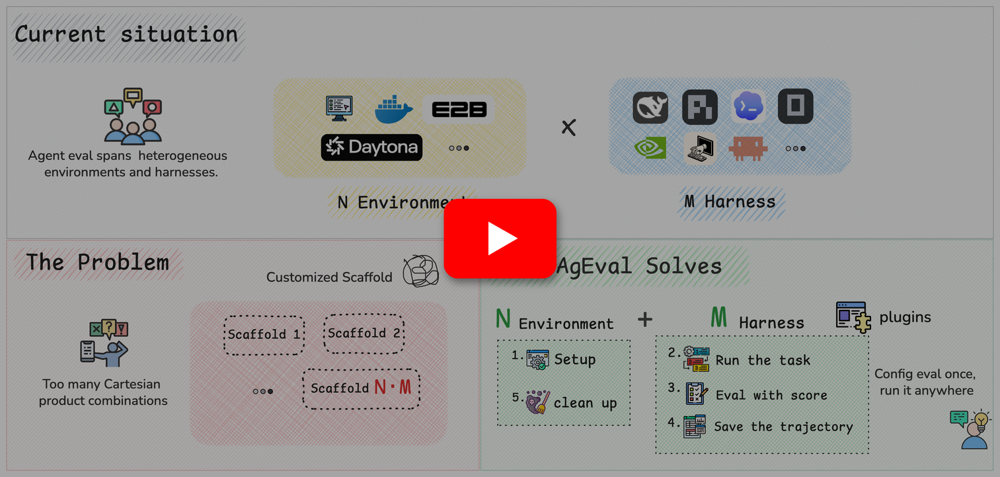
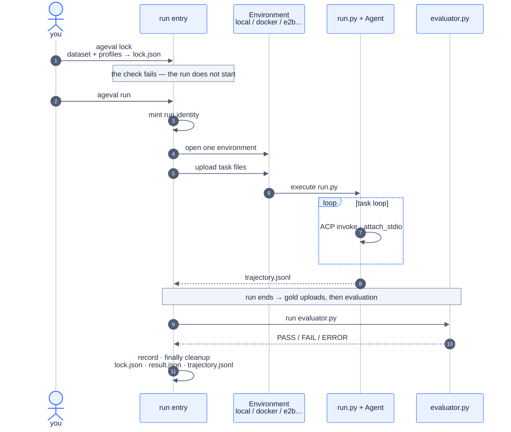
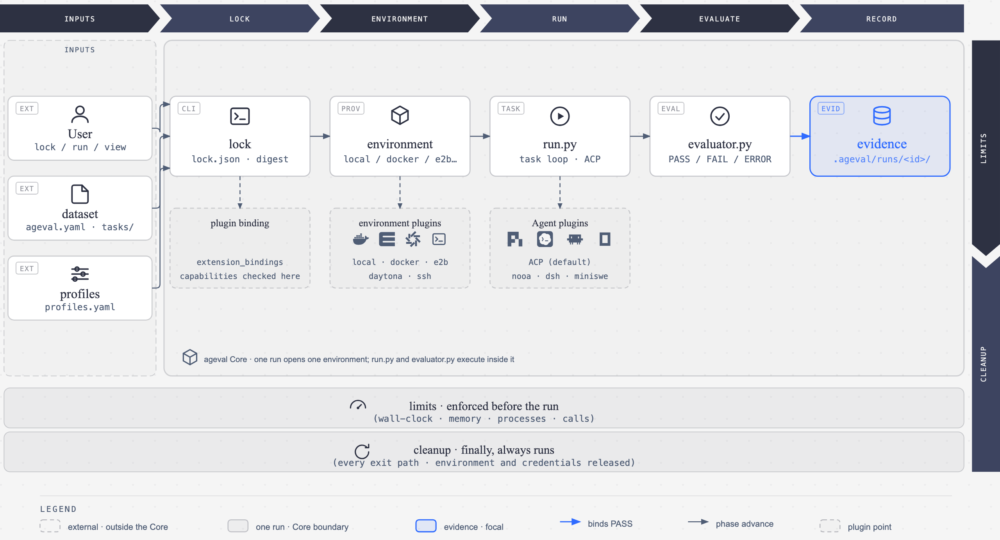

<div align="center"><a name="readme-top"></a>


# ageval

**English** · [简体中文](README.zh-CN.md)

<br/>

<!-- SHIELD GROUP -->

<a href="https://github.com/ZJU-REAL/ageval/stargazers"></a>
<a href="https://github.com/ZJU-REAL/ageval/releases"></a>
<a href="https://github.com/ZJU-REAL/ageval/actions/workflows/ci.yml"></a>
<a href="https://github.com/ZJU-REAL/ageval/blob/main/LICENSE"></a>
<a href="https://zju-real.github.io/ageval/en/docs/"></a>
<a href="#getting-started"></a>
<a href="https://youtu.be/MxiM9A9YvLc"></a>

</div>

<details>
<summary><kbd>Table of contents</kbd></summary>

#### TOC

- [⚡ Getting started](#getting-started)
  - [Install skills](#install-skills)
  - [Develop from source](#develop-from-source)
- [✨ Features](#features)
- [⚙️ How it works](#how-it-works)
  - [End-to-end flow](#end-to-end-flow)
  - [The base and plugins](#the-base-and-plugins)
- [📁 Project structure](#project-structure)
- [📖 Docs](#docs)

<br/>

</details>

How to avoid rewriting scaffolds for the massive set of agent runtime × model × environment combinations?

**ageval** switches the agent under test with plugins on one running base; install the CLI and skills so the Agent can design, convert, and run benchmarks; upload results to the open platform, and share or reuse public datasets, plugins, and agent configs.

<p align="center">
  <a href="https://youtu.be/MxiM9A9YvLc">
    
  </a>
</p>

## Getting started

```bash
uv tool install ageval-cli
# install everything, or only what you need
uv tool install 'ageval-cli[all]' # everything
uv tool install 'ageval-cli[e2b]' # one extra at a time

ageval -V
```

Run a dataset straight from the Hub, or any local dataset root:

```bash
ageval registry list                        # datasets visible on the Hub
ageval run <org>/<name>@<version> --task <task-id>
ageval executors -v
ageval view <org>/<name>@<version> --no-browser
```

### Install skills

Install skills for your local coding agent (CLI usage, plugins, dataset authoring, and more):

```bash
# install all
npx skills add ZJU-REAL/ageval
# install specific ones
npx skills add ZJU-REAL/ageval --skill ageval-cli
```

### Develop from source

To try the in-repo dataset examples and Agent catalog packs, or to build from source, clone the repo:

```bash
git clone https://github.com/ZJU-REAL/ageval.git
cd ageval
uv sync --frozen --all-packages
uv run ageval -V
```

Run the in-repo minimal example and inspect the results in the local Viewer:

```bash
uv run ageval tasks examples/datasets/minimal-demo
uv run ageval run  examples/datasets/minimal-demo --task terminal-jsonl-agg
uv run ageval view examples/datasets/minimal-demo --no-browser
```

<div align="right">

[![][back-to-top]](#readme-top)

</div>

## Features

**Quickly switch the agent under test**

Environments and agent runtimes join as plugins; the base stays untouched. Agents start over [ACP](https://agentclientprotocol.com) by default; [nooa](https://github.com/NVIDIA-NeMo/labs-OO-Agents), [dsh](https://github.com/deepseek-ai/deepseek-harness), and [miniswe](https://github.com/SWE-agent/mini-swe-agent) take the same plugin path. Switch by changing one line in `profiles.yaml`, or point at an agent for one run with `--agent`.

**Let the Agent run the eval**

The skill tells your coding agent how to use the CLI and how to author a dataset; from there it designs or converts a benchmark and runs the eval end to end. See [Getting started](#getting-started) to install the CLI and skills.

**Share and reuse on Hub**

Upload datasets, plugins, and agent configs together with results to ageval Hub, and manage members, dataset visibility, and versions there.

<div align="right">

[![][back-to-top]](#readme-top)

</div>

## How it works

### End-to-end flow



1. **`ageval lock` statically resolves the dependency graph (`ExtensionGraph`).** It maps plugins to the extension points exposed by the runtime base, establishing how implementations are dynamically invoked during execution. After checking capabilities and credentials, the resolved bindings are written to `lock.json`; secrets stay locators and never appear in plaintext.
2. **`ageval run` opens an environment and uploads the task files.** The environment can be local, Docker, or a cloud sandbox / remote host; missing pieces — Docker not running, a credential not set — are reported before anything runs.
3. **`run.py` runs the task loop inside that environment.** The loop, local tools, and Agent invocations all live in this file; changing the environment or the Agent doesn't touch it.
4. **Scoring is independent: only `evaluator.py` can return PASS.** gold uploads after the task ends, and it decides PASS / FAIL / ERROR; whatever the outcome, cleanup runs.

### The base and plugins

The ageval runtime base is a fixed pipeline: lock → environment → run → evaluate → record. The base exposes two main extension points: environment decides how the environment opens, and executor decides how the Agent is invoked — each binds exactly one plugin per run; chain hooks such as `after_environment_ready` run between phases.

Plugins fill these points through a single `ageval.plugin/1` manifest: export declares what it is, and the selected plugin registers into the service table under its service name; inject declares what it needs, listing dependencies by service name plus capabilities.

At `ageval lock`, the system resolves a deterministic, complete dependency graph (`ExtensionGraph`) for each profile. This graph locks the plugin bindings to the runtime base. During subsequent execution phases, the runtime base dynamically dispatches and invokes extension points strictly according to this graph. A capabilities or credentials mismatch fails right at lock, preventing failures mid-run. For example, the dsh plugin declares itself as the executor and injects the environment service, while docker exports the environment service — the two sides meet at lock:

```yaml
# plugins/dsh/plugin.yaml — the Agent plugin
plugin_id: dsh
slots:
  exclusive:
    - id: executor              # what it is: an agent runtime
inject:
  - service: environment        # what it needs: the environment service
    capabilities: [exec, upload]

# src/ageval/plugins/contrib/docker/plugin.yaml — an environment plugin
plugin_id: docker
slots:
  exclusive:
    - id: environment           # what it is: registers as the environment service
```

Environment plugins (docker / e2b / daytona, …) and Agent plugins (ACP by default; nooa / dsh / miniswe plug in the same way) all take this path; to add your own environment or Agent, write a plugin — no need to touch ageval source.

<p align="center">
  
</p>

<div align="right">

[![][back-to-top]](#readme-top)

</div>

## Project structure

```text
ageval/
├── src/ageval/
│   ├── cli/                         # argv, help, exit code
│   ├── application/
│   │   ├── composition.py           # sole production wiring; CLI imports build_* here
│   │   ├── lock.py                  # load_and_lock
│   │   ├── run.py                   # mint identity → run_attempt
│   │   ├── campaign.py / suite/     # matrix · suite · Always-k
│   │   └── agent_ops/ / plugin_ops / registry_ops/
│   ├── attempt/                     # Attempt pipeline
│   │   ├── __init__.py              # run_attempt
│   │   └── phases/                  # environment → run → evaluate → record · cleanup
│   ├── config/                      # dataset + task.yaml + profiles
│   ├── environments/protocol.py     # EnvironmentProvider · caps; no vendor SDK
│   ├── plugins/
│   │   ├── slots.py                 # exclusive / chain
│   │   └── contrib/                 # acp · local · docker · e2b · daytona · ssh
│   ├── runtime/                     # identity, parent Agent Service, task_worker
│   ├── evaluation/                  # bind PASS
│   └── evidence/                    # trajectory.jsonl layout
├── src/ageval_sdk/                  # ageval_sdk for run.py (no PASS, no host credentials)
├── plugins/                         # external ageval.plugin/1 (nooa, dsh, miniswe, …)
├── examples/
│   ├── datasets/
│   │   ├── minimal-demo/            # terminal-jsonl-agg · tau2-dialog-min · multiagent-env-min
│   │   └── tau3-airline-5/            # airline-00 … airline-04
│   └── agents/                      # ageval.agent/1
├── apps/viewer                      # ageval view SPA
├── apps/hub                         # Hub SPA
├── services/registry/               # package + results HTTP
├── docker/attempt/                  # official image; ACP entries baked in
├── docs/                            # mechanism design
└── website/                         # product docs
```

<div align="right">

[![][back-to-top]](#readme-top)

</div>

## Docs

- Usage: [`website/`](website/)
- Design: [`docs/`](docs/README.md)
- Examples: [`examples/README.md`](examples/README.md)
- [`AGENTS.md`](AGENTS.md)
- [`ARCHITECTURE.md`](ARCHITECTURE.md)

<div align="right">

[![][back-to-top]](#readme-top)

</div>

<!-- LINK GROUP -->

[back-to-top]: https://img.shields.io/badge/-↑_BACK_TO_TOP-1B54E8?style=flat-square
