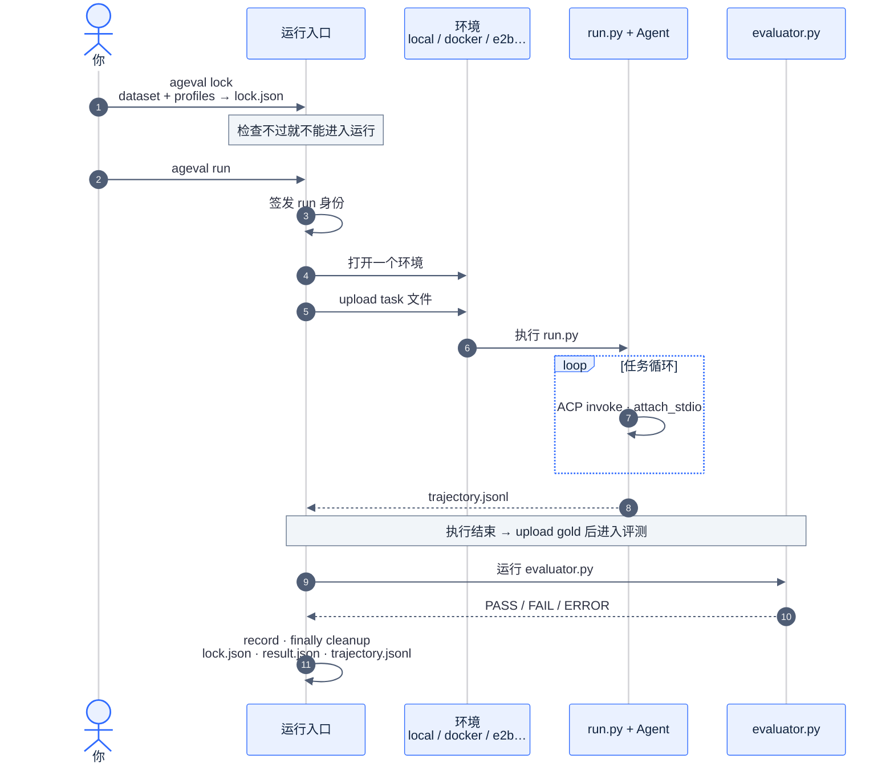
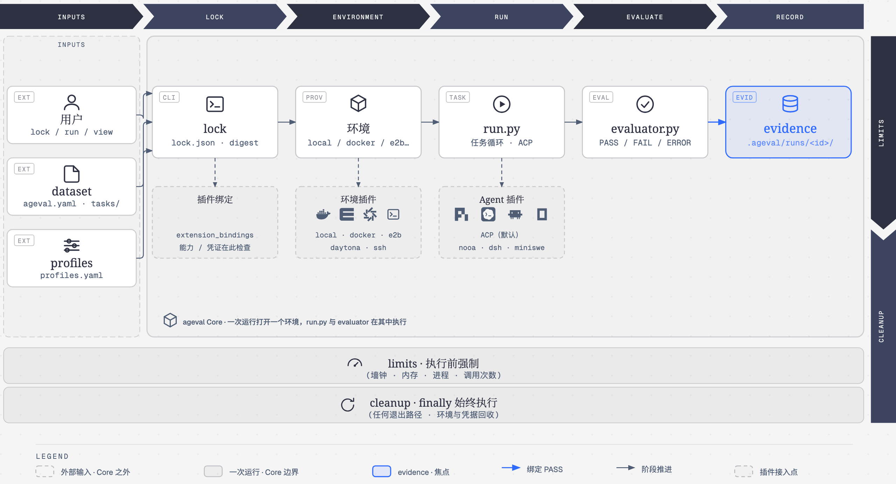

<div align="center"><a name="readme-top"></a>


# ageval

[English](README.md) · **简体中文**

<br/>

<!-- SHIELD GROUP -->

<a href="https://github.com/ZJU-REAL/ageval/stargazers"></a>
<a href="https://github.com/ZJU-REAL/ageval/releases"></a>
<a href="https://github.com/ZJU-REAL/ageval/actions/workflows/ci.yml"></a>
<a href="https://github.com/ZJU-REAL/ageval/blob/main/LICENSE"></a>
<a href="https://zju-real.github.io/ageval/zh-CN/docs/"></a>
<a href="#快速开始"></a>
<a href="https://youtu.be/MxiM9A9YvLc"></a>

</div>

<details>
<summary><kbd>目录</kbd></summary>

#### TOC

- [⚡ 快速开始](#快速开始)
  - [安装 skills](#安装-skills)
  - [从源码开发](#从源码开发)
- [✨ 功能](#功能)
- [⚙️ 如何运行](#如何运行)
  - [整体链路](#整体链路)
  - [基座与插件](#基座与插件)
- [📁 目录结构](#目录结构)
- [📖 文档](#文档)

<br/>

</details>

如何避免为 Agent 运行时、模型与环境的海量组合重复编写脚手架？

**ageval** 在统一运行基座上用插件切换待评测 Agent；装上 CLI 和 skill，Agent 能设计、转化 benchmark 并自动跑评测；还能将评测结果上传到开放平台，分享或复用公开的 dataset、插件和 Agent 配置。

<p align="center">
  <a href="https://youtu.be/MxiM9A9YvLc">
    
  </a>
</p>

## 快速开始

```bash
uv tool install ageval-cli
# 装全依赖或者按需安装
uv tool install 'ageval-cli[all]' # 一次装全
uv tool install 'ageval-cli[e2b]' # 按需装单个 extra

ageval -V
```

直接跑 Hub 上的 dataset，或跑任意本地 dataset 根目录：

```bash
ageval registry list                        # 查看 Hub 上可见的 dataset
ageval run <org>/<name>@<version> --task <task-id>
ageval executors -v
ageval view <org>/<name>@<version> --no-browser
```

### 安装 skills

为本机 coding agent 安装 skills（CLI 使用、插件、dataset 编写等）：

```bash
# 安装全部
npx skills add ZJU-REAL/ageval
# 指定安装
npx skills add ZJU-REAL/ageval --skill ageval-cli
```

### 从源码开发

体验仓库内的 dataset 示例以及 Agent 目录包，或需要从源码构建，clone 仓库：

```bash
git clone https://github.com/ZJU-REAL/ageval.git
cd ageval
uv sync --frozen --all-packages
uv run ageval -V
```

运行仓库内最小示例并在本地查看器查看结果：

```bash
uv run ageval tasks examples/datasets/minimal-demo
uv run ageval run  examples/datasets/minimal-demo --task terminal-jsonl-agg
uv run ageval view examples/datasets/minimal-demo --no-browser
```

<div align="right">

[![][back-to-top]](#readme-top)

</div>

## 功能

**快速切换待评测 Agent**

环境和 Agent 运行时都经插件接入，不必修改基座。默认通过 [ACP](https://agentclientprotocol.com) 启动 agent；[nooa](https://github.com/NVIDIA-NeMo/labs-OO-Agents)、[dsh](https://github.com/deepseek-ai/deepseek-harness)、[miniswe](https://github.com/SWE-agent/mini-swe-agent) 的接入走同一条插件路。修改配置文件 `profiles.yaml` 里的一行，或者用 `--agent` 临时指定来切换 agent。

**让 Agent 自己跑评测**

skill 会告诉你的 coding agent 怎么使用 CLI、怎么写 dataset；之后它自己设计或转化 benchmark，端到端跑完评测。参考[快速开始](#快速开始)，完成 CLI 和 skill 的安装。

**在 Hub 上分享与复用**

你可以将 dataset、插件和 Agent 配置与评测结果上传到 ageval Hub，并在 Hub 上组织管理成员、公开 dataset 范围与版本。

<div align="right">

[![][back-to-top]](#readme-top)

</div>

## 如何运行

### 整体链路

1. **`ageval lock` 静态解析插件依赖图（`ExtensionGraph`）。** 明确声明各个插件如何接入 runtime 基座开放的接入点，以及各接入点在运行时如何被动态调用。静态检查能力与凭据后，将绑定结果写入 `lock.json`；密钥只当 locator，不以明文写入。
2. **`ageval run` 打开一个环境，并把 task 文件传进去。** 环境可以是本机、Docker，或云沙箱 / 远端；缺 Docker、缺凭证这类问题会在正式运行前就报错提示。
3. **`run.py` 在环境里跑任务循环。** 循环逻辑、本地工具和对 Agent 的调用都写在这份文件里；换环境或换 Agent 不用改它。
4. **评分独立进行：只有 `evaluator.py` 能给出 PASS。** 任务结束才 upload gold，由它判定 PASS / FAIL / ERROR；无论结果如何，cleanup 都会执行。



### 基座与插件

ageval 的运行时基座是一条固定流水线：lock → environment → run → evaluate → record。基座上开放了两类主要接入点：environment 决定环境怎么开，executor 决定 Agent 怎么被调用，每次运行各绑定一个实现；另有 `after_environment_ready` 这类钩子穿插在阶段之间。

插件机制负责往这些接入点里装实现。插件用一份 `ageval.plugin/1` 声明自己：export 写明「我是什么」，选中的插件以服务名登记进服务表；inject 写明「我需要什么」，按服务名列出依赖和 capabilities。

在 `ageval lock` 阶段，系统会为每个 profile 解析出一张确定且完整的依赖图（`ExtensionGraph`）。这张 graph 锁定了插件与基座接入点的绑定关系，runtime 基座在后续运行阶段，严格沿着这张 graph 动态调度和调用各个实现。绑定与检查在 lock 期完成，capabilities 或凭证对不上直接失败，避免运行时中途出错。比如 dsh 插件声明自己是 executor、并 inject `environment` 服务，docker 插件则 export 出 `environment` 服务，两边在 lock 期完成图节点的连接与校验：

```yaml
# plugins/dsh/plugin.yaml —— Agent 插件
plugin_id: dsh
slots:
  exclusive:
    - id: executor              # 我是什么：一个 Agent 运行时
inject:
  - service: environment        # 我需要什么：环境服务
    capabilities: [exec, upload]

# src/ageval/plugins/contrib/docker/plugin.yaml —— 环境插件
plugin_id: docker
slots:
  exclusive:
    - id: environment           # 我是什么：登记为 environment 服务
```

环境插件（docker / e2b / daytona 等）和 Agent 插件（ACP 默认，nooa / dsh / miniswe 接入）都走这条机制；想接自己的环境或 Agent，写一个插件就行，不用改 ageval 源码。

<p align="center">
  
</p>

<div align="right">

[![][back-to-top]](#readme-top)

</div>

## 目录结构

```text
ageval/
├── src/ageval/
│   ├── cli/                         # 参数、帮助、退出码
│   ├── application/
│   │   ├── composition.py           # 生产接线唯一入口；CLI 只 import 此处的 build_*
│   │   ├── lock.py                  # load_and_lock
│   │   ├── run.py                   # 签发身份 → run_attempt
│   │   ├── campaign.py / suite/     # 矩阵 · suite · Always-k
│   │   └── agent_ops/ / plugin_ops / registry_ops/
│   ├── attempt/                     # 一次运行的流水线
│   │   ├── __init__.py              # run_attempt
│   │   └── phases/                  # environment → run → evaluate → record · cleanup
│   ├── config/                      # dataset + task.yaml + profiles
│   ├── environments/protocol.py     # EnvironmentProvider · 能力；不含厂商 SDK
│   ├── plugins/
│   │   ├── slots.py                 # exclusive / chain
│   │   └── contrib/                 # acp · local · docker · e2b · daytona · ssh
│   ├── runtime/                     # 身份、父进程 Agent Service、task_worker
│   ├── evaluation/                  # 绑定 PASS
│   └── evidence/                    # trajectory.jsonl 布局
├── src/ageval_sdk/                  # run.py 用的 ageval_sdk（不判定 PASS，不持有宿主凭据）
├── plugins/                         # 外置 ageval.plugin/1（nooa、dsh、miniswe 等）
├── examples/
│   ├── datasets/
│   │   ├── minimal-demo/            # terminal-jsonl-agg · tau2-dialog-min · multiagent-env-min
│   │   └── tau3-airline-5/            # airline-00 … airline-04
│   └── agents/                      # ageval.agent/1
├── apps/viewer                      # ageval view SPA
├── apps/hub                         # Hub SPA
├── services/registry/               # 包与结果 HTTP
├── docker/attempt/                  # 官方镜像；ACP entry 在 build 期装入
├── docs/                            # 机制设计
└── website/                         # 产品文档
```

<div align="right">

[![][back-to-top]](#readme-top)

</div>

## 文档

- 用法：[website/](website/)
- 设计：[docs/](docs/README.md)
- 示例：[examples/README.md](examples/README.md)
- [AGENTS.md](AGENTS.md)
- [ARCHITECTURE.md](ARCHITECTURE.md)

<div align="right">

[![][back-to-top]](#readme-top)

</div>

<!-- LINK GROUP -->

[back-to-top]: https://img.shields.io/badge/-↑_回到顶部-1B54E8?style=flat-square
