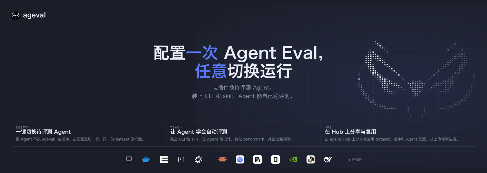

# ageval

<p align="center">
  
</p>

<p align="center">
  <a href="README.md">English</a> · <a href="README.zh-CN.md">中文</a>
</p>
<p align="center">
  <a href="https://github.com/ZJU-REAL/ageval/stargazers"></a>
  <a href="https://github.com/ZJU-REAL/ageval/blob/main/LICENSE"></a>
  <a href="https://github.com/ZJU-REAL/ageval/releases"></a>
  <a href="https://github.com/ZJU-REAL/ageval/commits"></a>
</p>

大多数 Agent 评测仍停留在**模型**：同一套提示、同一套工具约定，比较不同权重或不同 API。可交付的 Agent 却是模型加上它的运行时——同一套权重接到不同的 coding agent、工具策略或环境上，行为和成本都会变。配得上「比较」的评测因此是一个乘积：**H 个 Agent 运行时 × M 个模型 × E 个环境**。每个组合都要一套脚手架；组合不写进 lock，分数就不可比。

**ageval** 把这个乘积从代码收成配置：一份 dataset（`run.py` + `evaluator.py`）写一次，环境和 Agent 在 `profiles.yaml` 上经插件绑定，和模型一起 lock 成可复现 digest。**Hub** 用来发布 dataset、插件与 Agent 包；公开榜只收录发过版、跑完整份 dataset 的结果。

<p align="center">
  
</p>

## 目录

- [是什么](#是什么)
- [如何运行](#如何运行)
- [功能](#功能)
- [快速开始](#快速开始)
- [架构](#架构)
- [目录结构](#目录结构)
- [文档](#文档)

## 是什么

一份 dataset 写一次，换环境和 Agent 不用改 `run.py`。分数要带上用了哪个 Agent 运行时、哪套环境，不能只报模型名。

- **交付单位是 dataset。** 一份 dataset 含若干 task；每个 task 有业务循环（`run.py`）、评分（`evaluator.py`）和 gold。环境和 Agent 写在 `profiles.yaml` 里，不写进 dataset。
- **一次运行能打开看。** 顺序是 environment → run → evaluate → record，cleanup 始终执行。目录在 `.ageval/runs/<id>/`。
- **换环境不用改题。** 本机、Docker，或云沙箱 / 远端（[e2b](https://e2b.dev)、ssh、[daytona](https://www.daytona.io)）。缺能力或缺凭证时，`ageval lock` 失败，不会开始跑。
- **Coding agent 通过插件接入。** 默认用 [ACP](https://agentclientprotocol.com)（[pi](https://pi.dev)、[Codex](https://github.com/openai/codex)、[Claude Code](https://github.com/anthropics/claude-code)、[OpenCode](https://github.com/sst/opencode)）；[nooa](https://github.com/NVIDIA-NeMo/labs-OO-Agents)、[dsh](https://github.com/deepseek-ai/deepseek-harness)、[miniswe](https://github.com/SWE-agent/mini-swe-agent) 同样经插件进来，走同一套运行路径和榜单。
- **结果有归处。** 本机 Viewer 按 Jobs → Tasks 打开一次运行；Hub 发布 dataset、插件与 Agent 包。公开榜只收录发过版、跑完整份 dataset 的结果。

## 如何运行

```text
            你 ── lock / run ──►  ┌─────────────────┐
                                  │    一次运行     │  lock dataset · digest
                                  │   ageval Core   │  environment → run
                                  │                 │  evaluate → record
                                  │                 │  finally cleanup
                                  └────────┬────────┘
                                           │ 打开一个环境
              ┌────────────────────────────┼────────────────────────────┐
              ▼                            ▼                            ▼
        ┌───────────┐                ┌───────────┐                ┌───────────┐
        │   local   │                │  docker   │                │ e2b/ssh/daytona │
        └─────┬─────┘                └─────┬─────┘                └─────┬─────┘
              └──────── Protocol: upload · exec · attach_stdio ─────────┘
                                           │
                                           ▼
                                  ┌─────────────────┐
                                  │     run.py      │  任务循环 · 调用 Agent
                                  │  ACP / plugin   │  插件接入
                                  └────────┬────────┘
                                           ▼
                                  ┌─────────────────┐
                                  │  evaluator.py   │  PASS 的唯一来源
                                  └─────────────────┘
```

1. **lock。** 把 dataset、环境和 Agent 合成 digest。密钥只当 locator，不以明文写入 lock。
2. **打开环境。** 本机、Docker，或云沙箱 / 远端。缺能力或缺凭证时，在打开之前失败。
3. **跑 `run.py`。** 循环、工具与 Agent 调用写在这里。换环境或 Agent 不用改这份文件。
4. **独立评分。** gold 在这个阶段进入环境，由 `evaluator.py` 给出 PASS / FAIL / ERROR。cleanup 始终执行。

## 功能

**评测**

- **一次 lock。** dataset、Agent 运行时和环境写进同一次 lock，得到可复现 digest。
- **单题、整份 dataset、矩阵与重复。** 可跑单个 task、整份 dataset、同一 task 上的参数矩阵，或同一份配置下的多次独立运行（pass@k）。
- **评分与 Agent 分离。** gold 不进 Agent 能看见的文件。PASS 只来自 `evaluator.py`（缺省确定性脚本；可选 `Agent.session` 做 LLM-as-judge）。轨迹用来检查过程。
- **limits 在调用前强制。** 墙钟、内存、进程与调用次数由 runtime 在 invoke 之前确定。

**组合**

- **同一份 `run.py`，换绑定。** 环境和 Agent 经插件组合。默认 [ACP](https://agentclientprotocol.com)；[nooa](https://github.com/NVIDIA-NeMo/labs-OO-Agents)、[dsh](https://github.com/deepseek-ai/deepseek-harness)、[miniswe](https://github.com/SWE-agent/mini-swe-agent) 同样经插件接入，走同一套运行路径和榜单。
- **Agent 包。** format `ageval.agent/1`（executor、entry、overlays）。内置包用 `--agent pi` 绑定（不必 install）。定制 overlays 包仍先 `ageval agent install`，再 `--agent org/name@version`。`binding.model` 是缺省；`--model` 改这次 run。
- **多角色与多 session。** 对话、工具与 handoff 写在 task 里；runtime 提供环境和 Agent 入口。
- **调用前校验。** 能力与凭证在 Agent 调用之前核验；缺了就失败，不会开始 invoke。

**环境**

- **本机、容器、云沙箱、远端。** local、docker、[e2b](https://e2b.dev)、ssh、[daytona](https://www.daytona.io)：`upload` / `exec` / `attach_stdio`。
- **Agent 只能看见允许的文件。** gold 与宿主凭据不进 dataset 的默认环境。
- **官方运行镜像。** Docker 在 build 期装入 ACP 入口，invoke 时不再安装。

**结果与协作**

- **本机 Viewer。** 按 Jobs → Tasks 查阅轨迹、环境与评分。
- **导出轨迹。** 导出一份副本，不修改分数。
- **Hub。** 发布 dataset、插件与 Agent 包，上传整份 dataset 的结果。组织管理成员、公开范围与版本；公开榜只收录发过版、跑完整份 dataset 的结果。部署可用 `docker compose -f services/registry/docker-compose.yml up -d`（Postgres、对象存储、Registry、Hub），发版标签会把 `ghcr.io/zju-real/ageval-hub` / `ageval-registry` 推到 GHCR。

**编写**

- **一道题只写这道题。** 循环、工具、评分与 gold；编排不属于 task。
- **SDK 可选。** session、Tool、终端。不判定 PASS，不持有宿主凭据。

## 快速开始

需要 [uv](https://docs.astral.sh/uv/) 与 CPython **3.12+**。实际运行 coding agent 还需要本机 ACP 入口与凭据。仅执行 `ageval lock` 时不需要。

```bash
git clone https://github.com/ZJU-REAL/ageval.git
cd ageval
uv sync --frozen --all-packages
uv run ageval -V
```

```bash
uv run ageval tasks examples/datasets/minimal-demo
uv run ageval lock examples/datasets/minimal-demo --task terminal-jsonl-agg
uv run ageval run  examples/datasets/minimal-demo --task terminal-jsonl-agg
uv run ageval run  examples/datasets/minimal-demo --task terminal-jsonl-agg \
  --profiles examples/datasets/minimal-demo/profiles.e2b-acp.yaml --probe
uv run ageval executors -v
uv run ageval view examples/datasets/minimal-demo --no-browser
```

`examples/datasets/minimal-demo` 的默认环境为 docker。内置 Agent 包用 `--agent pi`（不必 install）。可选 `--model` 改这次 run。定制 overlays 包仍先 `ageval agent install`，再 `--agent org/name@version`。

仓库内示例见 [`examples/README.md`](examples/README.md)：`minimal-demo`、五题缩略的 `tau3-airline-5`，以及 Agent 目录包。

## 架构

```text
  ageval.yaml + task.yaml + profiles.yaml
                 │
                 ▼
           ageval lock                 digest · extension_bindings
                 │
                 ▼
           ageval run  ── 一次运行 ── environment → run → evaluate → record
                 │                      finally cleanup
                 ▼
        .ageval/runs/<id>/             lock.json · result.json · trajectory.jsonl
                 │
      ┌──────────┼──────────┐
      ▼                     ▼
 ageval view          Registry / Hub
 本机 Jobs            publish · upload-suite · Leaderboard
```

- lock 是规范入口：未知 format 一次失败。插件改的是绑定，不重排 environment → run → evaluate → record 这几个阶段。
- 一次运行管身份、时限、cleanup 与出分。
- 本机 Viewer 读文件；Hub 连 Registry。

## 目录结构

由 [`ARCHITECTURE.md`](ARCHITECTURE.md) 简化。`.ageval/`、`.venv/` 等生成目录不算源码。

```text
ageval/
├── src/ageval/
│   ├── cli/                         # 参数、帮助、退出码
│   ├── application/
│   │   ├── composition.py           # 生产接线唯一入口；CLI 只 import 此处的 build_*
│   │   ├── lock.py                  # load_and_lock
│   │   ├── run.py                   # 签发身份 → run_attempt
│   │   ├── campaign.py / suite/     # 矩阵 · suite · Always-k
│   │   └── agent_ops/ / plugin_ops / registry_ops/
│   ├── attempt/                     # 一次运行的流水线
│   │   ├── __init__.py              # run_attempt
│   │   └── phases/                  # environment → run → evaluate → record · cleanup
│   ├── config/                      # dataset + task.yaml + profiles
│   ├── environments/protocol.py     # EnvironmentProvider · 能力；不含厂商 SDK
│   ├── plugins/
│   │   ├── slots.py                 # exclusive / chain
│   │   └── contrib/                 # acp · local · docker · e2b · daytona · ssh
│   ├── runtime/                     # 身份、父进程 Agent Service、task_worker
│   ├── evaluation/                  # 绑定 PASS
│   └── evidence/                    # trajectory.jsonl 布局
├── src/ageval_sdk/                  # run.py 用的 ageval_sdk（不判定 PASS，不持有宿主凭据）
├── plugins/                         # 外置 ageval.plugin/1（nooa、dsh、miniswe 等）
├── examples/
│   ├── datasets/
│   │   ├── minimal-demo/            # terminal-jsonl-agg · tau2-dialog-min · multiagent-env-min
│   │   └── tau3-airline-5/            # airline-00 … airline-04
│   └── agents/                      # ageval.agent/1
├── apps/viewer                      # ageval view SPA
├── apps/hub                         # Hub SPA
├── services/registry/               # 包与结果 HTTP
├── docker/attempt/                  # 官方镜像；ACP entry 在 build 期装入
├── docs/                            # 机制设计
└── website/                         # 产品文档
```

## 文档

- 用法：[website/](website/)
- 设计：[docs/](docs/README.md)
- 示例：[examples/README.md](examples/README.md)
- [AGENTS.md](AGENTS.md)
- [ARCHITECTURE.md](ARCHITECTURE.md)
