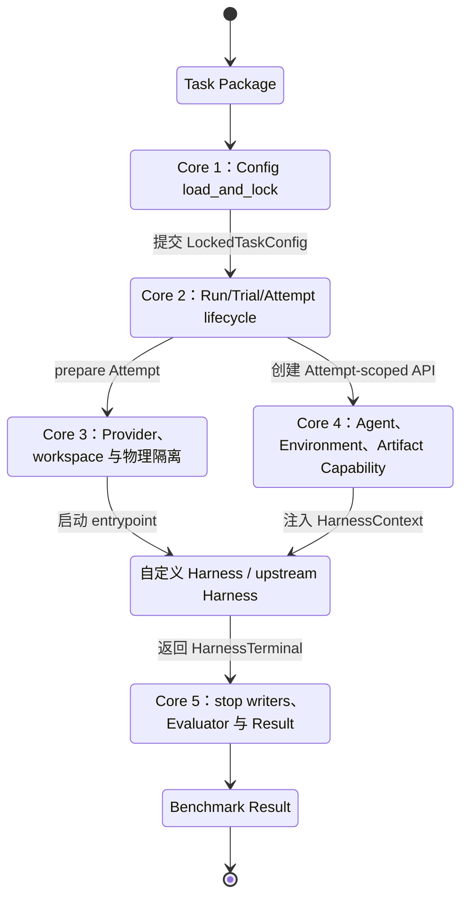

# 01 — BORA Core：五组机制与模块布局

| 字段 | 值 |
| --- | --- |
| 产品 | Bounded Orchestration for Runtime Agents（BORA） |
| 权威 | **本文件与同目录其它 design 文档共同构成设计权威**（自包含；不依赖 vault 总文档） |
| 摘要 | Harness 的 Harness、Core 1–5、关系、排除项与目标模块布局。 |

---

## 2. BORA Core 到底包含什么

### 2.1. “Harness 的 Harness”

Pi 这类 Agent Core 负责运行一个 Agent loop。BORA 位于更外层：它接收一个 Benchmark Task Package，准备运行边界，启动 package 自己的 Harness，再在 Harness 结束后运行独立 Evaluator。因此，“Harness 的 Harness”是准确的定位。

BORA Core 不替 Benchmark 决定内部工作流。它保证任意已接入 Harness 都经过相同的配置、运行身份、隔离、Capability、产物和评测生命周期。

```text
Task Package
  → BORA Core 准备并锁定外层运行
  → 自定义 Harness / upstream Harness 执行内部算法
  → BORA Core 停止 writers、固定 allowlisted inputs 并独立评测
  → Benchmark Result
```

### 2.2. 五组必须保留的 Core 机制

本文使用两层 “Core”：**BORA Core** 指外层执行内核，也就是下面五组机制；**Harness Core** 指提供给 `harness.py` 的可选 Python SDK。Harness Core 可以被 upstream Framework 替代，不拥有 Run、Provider、Environment 或最终评测 authority。

| Core | 输入 | 输出 | 解决的问题 |
| --- | --- | --- | --- |
| Core 1：配置加载与锁定 | `bora.yaml`、variant、显式 override | `LockedTaskConfig` | 本次运行使用什么入口、参数、能力和 evaluator contract |
| Core 2：Run/Trial/Attempt 生命周期 | locked config、Run request | Attempt status 与 evidence | 谁创建执行身份，prepare、run、evaluate、cleanup 如何排序 |
| Core 3：Provider 与物理隔离 | Provider config、workspace plan | 受限 runtime | container、process、mount、network、secret 与隔离档如何强制 |
| Core 4：Capability API | Attempt scope、已准备资源 | `HarnessContext` | Harness 如何调用 Agent、Environment、Workspace 和 Artifact，又不能获得额外权限 |
| Core 5：Evaluator 与结果绑定 | Harness terminal、declared output、allowlisted evaluator input | 扁平 Result 与内部 evidence | Harness 自报完成不能代替 Benchmark truth，评测与清理事实如何保存 |

这五组机制构成 BORA 的最小平台内核。Campaign、CLI、ComparisonReport 和网站投影可以位于 application 层；Actor、Router、Context、Tool、branch 和 join 留在 Harness 层。

### 2.3. Core 1：配置加载与锁定

Config Core 是 `bora.yaml` 的唯一读取者，对外只提供一个原子入口：

```text
load_and_lock(package, task, variant, overrides)
  → LockedTaskConfig
```

实现内部仍可分解为读取、合并、校验、canonicalize、digest 和 lock，但这些步骤不是 package 作者需要编排的公共流水线，也不要求形成 Loaded / Resolved / 多套 ProjectedConfig **公开 DTO**。锁定之后仍会向消费者提供**轻量 view**（例如 Runtime 读 envelope sections，Harness 经 `ctx.params` 读 `parameters`）——这是可见性投影，不是配置仪式。没有统一配置和锁定，一次 Trial 使用了什么超参数、资源和 evaluator 输入就无法确定；Config Core 只处理配置值和外部引用，不解释 Python workflow。

### 2.4. Core 2：Run、Trial 与 Attempt 生命周期

Lifecycle Core 拥有外层状态机和执行身份：

```text
Run
└── Trial
    └── Attempt
        ├── Harness invocation
        ├── Agent invocations
        ├── Environment binding
        ├── Artifact outputs
        ├── Evaluation
        └── Cleanup
```

它负责：

- 为每次执行分配稳定 identity；
- 按顺序驱动 prepare、Harness、writer stop、evaluate 和 cleanup；
- 保存诊断与复盘所需的内部阶段 evidence，并对外组装扁平结果；
- 在 timeout、cancel 或异常后进入同一 cleanup 路径；
- 确保 retry 创建新的 Attempt，不静默修改 Trial。

Harness 只拥有一个 Attempt 内的业务 loop。Campaign 只拥有多个 Trial 的调度。两类 scheduler 不合并。

### 2.5. Core 3：Provider 与物理隔离

Provider Core 负责 Python 代码无法自行证明的 OS 和信任边界：

- container、VM 或 local process；
- image、platform、working directory；
- workspace、mount、PathGrant，以及 L2 才要求的 UID/GID；
- network 和 secret projection；
- process start、timeout、cancel、kill；
- 停止 writers；timeout/kill 后确认不再写入即可，不要求独立的干净退出证明。

这一层保留在 Core，因为 Harness 内的 `Context` 只能决定 prompt 文本。两个 Agent 是否能读取同一个文件、是否能直连数据库、是否能获得 credential，取决于 Provider 创建的实际 runtime view。

隔离按档位声明：L0 提供基础进程边界，L1 增加明确 path views，L2 再增加 per-actor mount、UID/GID 或更强沙箱。Result 必须记录实际档位，低档实现不能宣称高档保证。

### 2.6. Core 4：Capability API

Runtime 通过 `HarnessContext` 把本次 Attempt 已获准的外部能力注入 Harness：

```python
@dataclass(frozen=True)
class HarnessContext:
    params: HarnessParameterView
    scope: RunScope
    agent: AgentCapability
    environment: EnvironmentCapability
    workspace: WorkspaceCapability
    artifacts: ArtifactCapability
    events: EventSink
```

Capability Core 包含：

| Capability | Harness 可以做什么 | Runtime 继续控制什么 |
| --- | --- | --- |
| `params` | 读取本次 locked 超参数的 **parameter view** | 参数来源、variant 合并和 Trial identity；不暴露 gold / credential |
| `scope` | 读取 Attempt、deadline、cancel 和剩余时间 | 最终 timeout 和 process termination |
| `agent` | 请求一次真实 Agent invocation | profile、credential projection、workspace view、总调用上限 |
| `environment` | 绑定 resource，执行 allowlisted action | namespace、secret projection、外部 action ceiling、teardown，以及按需 freeze/getter |
| `workspace` | 选择已声明 actor/invocation 的 **path view** | mount、PathGrant、L2 时的 UID/GID——物理可见性投影 |
| `artifacts` | 按 logical name publish declared output | path 检查、consumer scope、materialize 只读视图与固定 evaluator 输入 |
| `events` | 记录少量 Agent、Tool 和 Harness 事件 | Attempt identity 和正式 evidence boundary；**不能**替代 Agent Service 的 per-invocation 轨迹落盘（见 [05 §8.9](05-runtime-core.md#89-attempt-evidence-与-agent-轨迹落盘)） |

MVP 使用进程内对象。未来可用 JSONL、stdio 或 scoped socket 承载同一 **Capability transport**，但 transport 不进入 Harness API，也不作为本轮默认实现目标。  
**注意：** 「默认不做 Capability JSONL transport」≠「不做 evidence 目录 JSONL 轨迹」。后者是产品红线（design/00 §0.2）。

### 2.7. Core 5：Evaluator 与结果绑定

Evaluation Core 对外只有四段语义：停止 writers、materialize allowlisted evaluator inputs、独立 Evaluate、Record + cleanup。Artifact digest、只读副本、clean evaluator runtime、Environment freeze/getter 和 raw-output 校验可以在内部按 input strategy 实现；artifact-only task 不被迫配置 stateful freeze。

这一边界必须留在 Core，因为 Harness 自报 `completed` 不能成为 Benchmark score。Evaluator 是 task-local truth owner，BORA 负责隔离运行和结果绑定；cleanup 失败保留为 warning，不覆盖已经形成的 score。

### 2.8. 五个 Core 的关系



### 2.9. Core 明确不包含什么

以下内容不进入 BORA Runtime Core：

- Actor registry 和角色类型系统；
- 通用 Router、Planner 或 Reducer Service；
- Core-owned team memory 或 Conversation ledger；
- 每个本地 Tool 的宿主 ToolPort；
- 通用 Handoff、BranchAuthority 和 Join ledger；
- 描述所有 workflow 的 Graph IR；
- 为每个内部函数生成 receipt 的审计体系；
- 按 Benchmark 名称分支的 Adapter。

MVP 也不承诺 durable/reopen、默认 **Capability** JSONL/stdio transport、所有 task 强制 freeze/per-actor UID/GID、公开 Artifact 用户类型阶梯、或对外完整**阶段结果**聚合 schema。**可见性投影**与 **Attempt evidence / Agent 轨迹落盘**始终保留。不要求的是「六路 Config projection DTO」这类配置仪式，不是「不做投影」或「不落盘轨迹」。隔离档、input strategy 与内部 digest 可以存在；只有出现真实跨进程共享、并发竞争、崩溃恢复或后台 reopen 后，才重新评估 durable platform authority。

### 2.10. Core 模块布局

```text
src/bora/
├── config/                  # Core 1
│   ├── model.py             # LockedTaskConfig
│   └── load_and_lock.py     # 内部可调用 resolver / validator
├── runtime/                 # Core 2
│   ├── coordinator.py
│   ├── lifecycle.py
│   ├── identity.py
│   ├── outcomes.py
│   └── cancellation.py
├── provider/                # Core 3 contract
│   ├── contract.py
│   └── workspace_plan.py
├── capabilities/            # Core 4 contract
│   ├── agent.py             # AgentCapability 面（invoke 契约）
│   ├── environment.py
│   ├── workspace.py
│   ├── artifact.py
│   └── events.py
├── agent_service/           # Agent 后端调度（profile → executor）
│   ├── service.py           # 解析 agent_profiles、session 绑定、额度
│   ├── contract.py          # AgentExecutor 协议 / 归一化 AgentResult
│   └── registry.py          # entry point 发现：kind → Adapter
├── evaluation/              # Core 5
│   ├── runner.py
│   ├── inputs.py
│   └── result_binding.py
├── harness/                 # 可选 Harness Core / SDK
│   ├── agent.py
│   ├── context.py
│   ├── tools.py
│   ├── hooks.py
│   ├── guards.py
│   ├── workflow.py
│   └── scope.py
├── adapters/                # first-party 参考实现；亦可外置为独立包
│   ├── provider_docker/
│   ├── agent_codex/         # 或 bora-executor-codex（entry point kind=codex）
│   ├── agent_pi/            # 或 bora-executor-pi（entry point kind=pi）
│   ├── environment_mysql/
│   ├── environment_postgres/
│   ├── environment_browser/
│   └── artifact_filesystem/
└── application/
    ├── run_command.py
    ├── campaign_command.py
    └── composition.py
```

“Core”表示必须稳定的职责，不要求按图中每个名字硬拆文件。Application 负责组装；**机制实现**可以是主仓 first-party，也可以是实现约定 entry point 的用户/第三方包（§8.4.6–8.4.10）。Harness Core 是 Task Package 侧可选 library。
