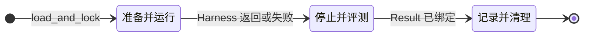

# 05 — Runtime Core（Lifecycle / Provider / Capability 运行 / Evaluation）

| 字段 | 值 |
| --- | --- |
| 产品 | Bounded Orchestration for Runtime Agents（BORA） |
| 权威 | **本文件与同目录其它 design 文档共同构成设计权威**（自包含；不依赖 vault 总文档） |
| 摘要 | Run Coordinator、Provider、Agent Service、Environment、Artifact、Evaluator、Campaign、外层状态机。 |

---

## 8. Core 2–5 详细设计：Runtime

### 8.1. Runtime 的职责

Runtime Core 保留 Harness 无法可靠强制的外部职责：

- Run、Trial、Attempt 和 Invocation identity；
- Provider、container、process、mount 和 workspace lifecycle，以及高隔离档的 UID/GID；
- Agent Provider invocation、credential projection 和外部成本边界；
- network、secret、path 和 resource capability；
- 数据库、Browser、VM 等 Environment 的 prepare、action 和 teardown，以及按需 reset/freeze/getter；
- declared Artifact 的 publish registry 与内部 materialization；
- writer barrier、独立 evaluator、hidden material 和结果绑定；
- wall time、memory、process、Agent invocation 和外部 action ceiling；
- Runtime、Harness、Evaluation 和 Cleanup 事实的分离。

Runtime 不解释 Retail action、AgentVerse memory、MARBLE branch、Planner、Reducer 或 Tool 业务名称。

### 8.2. Run Coordinator

Run Coordinator 拥有外层状态机：

```text
Prepare: load_and_lock → Provider / Environment → Harness
Evaluate: stop writers → materialize allowlisted inputs → Evaluator
Finish: bind flat Result → record evidence → cleanup
```

Coordinator 只观察阶段结果。它不保存 Harness messages，也不监听每一个本地 Tool call。

### 8.3. Provider

Provider 负责代码运行位置和 OS 级限制：

- container、VM 或 local process；
- image、platform、working directory；
- UID/GID 和 mount；
- actor-specific 或 invocation-specific WorkspaceView；
- network 和 secret projection；
- process start、timeout、cancel 和 kill；
- 停止 writers；timeout/kill 后确认不再写入即可，不要求独立的干净退出证明。

所有 Agent 使用同一个 Attempt volume 只有在配置明确授予相同 WorkspaceView 时才成立。不同 Agent 需要不同可见性时，Provider 使用独立 mount、PathGrant 或 OS permission。Actor 名称本身不会产生隔离。

### 8.4. Agent capability、Agent Service 与多后端切换

#### 8.4.1. 术语：Task Harness ≠ Agent 后端

| 概念 | 是什么 | 谁拥有 |
| --- | --- | --- |
| **Task Harness** | package 的 `harness.py` / upstream workflow | Task Package |
| **Agent 后端 / Executor** | 真正执行一次模型/agent 调用的实现（`codex`、`claude-code`、`pi`、HTTP API…） | Runtime **Agent Service** + Executor Adapter |
| **agent_profile** | 命名绑定：`executor` + `model` + `options` + `workspace_view` | `bora.yaml` → LockedTaskConfig |
| **profile 引用** | Harness 使用的逻辑名（如 `parameters.models.planner`） | `parameters`（可被 Campaign override） |

口语里的「换 agent harness」在 BORA 里指 **换 Agent Executor / profile**，不是换 `harness.py`。Task workflow 保持稳定，后端可替换，这是可比实验的基础。

#### 8.4.2. 配置如何表达切换与混用

```yaml
agent_profiles:
  - id: specialist-codex
    executor: codex              # Executor Adapter kind
    model: o4-mini              # 该 executor 认识的模型标识
    workspace_view: agents
    options: {}                 # executor 专有旋钮（温度、超时等），进入 lock

  - id: planner-pi
    executor: pi
    model: default
    workspace_view: agents

  - id: specialist-cc
    executor: claude-code
    model: claude-sonnet-4
    workspace_view: agents

parameters:
  models:
    specialist: specialist-codex   # 或 specialist-cc
    planner: planner-pi            # 同 task 内混用不同后端
    reducer: specialist-codex
```

- **整 task 换后端（Codex → Claude Code）：** Campaign variant 改写 `parameters.models.*` 指向另一组 profile，或 override 现有 profile 的 `executor`/`model`；**不必改** `harness.py`。
- **同 task 不同 Agent 用不同后端：** 各 role 引用不同 profile id 即可；specialist 走 Codex、planner 走 Pi 合法。
- **同 executor 不同模型：** 只改 profile 的 `model` 字段，或增加并列 profile。

`load_and_lock` 必须校验：每个 `parameters` 中的 profile 引用存在；每个 `executor` kind 在 Agent Service 的注册表中可用；`workspace_view` 存在。锁定结果含 profile → executor/model 的解析快照，进入 Trial identity / digest。

#### 8.4.3. Agent Service（Runtime）

Agent Service 是 Runtime 内的调度面，不是插件市场：

```text
ctx.agent.invoke(profile_id, messages, ...)
  → 查 LockedTaskConfig.agent_profiles[profile_id]
  → 选 Executor Adapter(executor kind)
  → 注入 credential / workspace view / network projection
  → 调后端（CLI 子进程、API、或受控 agent runtime）
  → 归一化为 AgentResult（content / structured / usage / session）
```

职责：

| 职责 | 说明 |
| --- | --- |
| Profile 解析 | 把逻辑 profile 绑到具体 executor + model + options |
| Executor 路由 | `codex` / `claude-code` / `pi` / … 各一 Adapter |
| Session 绑定 | 创建时固定 Attempt + profile + workspace；禁止跨 Attempt 复用 |
| 统一 invoke 契约 | Harness 只见 messages / schema / tools 意图，不见各 CLI 细节 |
| 额度与安全 | `limits.agent_invocations`、capability close、secret 不进 package 代码 |
| 可观测 | usage、executor kind、model、latency 写入 evidence（供对比后端） |

Harness / Harness Core 的 `Agent(..., model_profile=params.planner_model)` **只传 profile id**；不得 `import` 某个具体 agent CLI SDK 写死后端。

#### 8.4.4. 归一化 invoke 契约（跨后端）

所有 Executor Adapter 至少支持：

```python
result = await ctx.agent.invoke(
    profile_id="planner-pi",
    messages=[{"role": "user", "content": "..."}],
    output_schema=optional_json_schema,  # 后端不支持则 Adapter 降级/报错策略进 lock 说明
    tools=optional_tool_specs,           # 仅当该 executor 支持 tool loop
    session=optional_handle,
)
# result: content, structured_output?, usage, session_handle?
```

后端能力差（有的无 structured output、有的 tool 形态不同）由 **Adapter 适配 + profile/options 声明**，不由 Task Harness 分支 `if executor == "codex"`。若某后端无法满足 task 所需契约，Config validation 在 Attempt 前失败，而不是运行中静默降级出不可比分数。

#### 8.4.5. 热路径与限制

创建 session 时，Runtime 检查 Attempt identity、profile（含 executor/model）、WorkspaceView 和 capability scope，并将绑定结果固定。`ctx.agent.invoke` 热路径只检查 capability open、deadline/cancel、`limits.agent_invocations` 与 Executor 调用结果。

Session handle 绑定当前 Attempt 和 **profile id**（从而绑定 executor），不能跨 Attempt 复用，也不能在同一 session 上中途更换 executor。

#### 8.4.6. 扩展模型：Core 开放接口 + 可分发插件

BORA **允许用户与第三方按 Core 契约实现定制化插件**，并以 Python 包装分发（例如 `pip install bora-executor-pi`）。这不是开放技能商店，也**不是**只能扩展 Agent：

| 做 | 不做 |
| --- | --- |
| Core 固定薄接口（如 `AgentExecutor`；其它扩展面各自有契约） | 插件任意 patch Core 源码 |
| 插件包实现接口并用 **entry point 注册 kind** | 未在配置中引用的插件静默改行为 |
| `bora.yaml`（或等价声明）选型启用 | 运行中热装、浮动 `latest` |
| 凭据由 Runtime **投影**进插件运行环境 | 密钥写入 package / `bora.yaml` |
| 插件 version/digest 进入 lock（可复盘） | 评测路径默认信任任意远程市场 |

**调度面留在主仓**（例如 Agent Service 负责路由、session、额度、投影、归一化）。**可插拔、可外置分发的是各扩展面的实现包**——冷门后端不必塞进主仓库，作者按接口写包即可。

> [!important] 扩展面不限于 Agent invoke
> Core 在多处开放稳定契约。下表是优先鼓励外置实现的扩展面；**§8.4.7–8.4.8 以 Agent Executor（Pi）示范全链路**，同一「接口 → 注册 → 配置引用 → 凭据投影」模式适用于其它行，只是接口形状不同。

| 扩展面 | Core 开放的契约（方向） | 配置选型（例） | 示例实现 |
| --- | --- | --- | --- |
| **Agent 后端** | `AgentExecutor.invoke`（§8.4.7） | `agent_profiles.executor` | `pi` / `codex` / `claude-code` |
| **Provider** | 隔离与 workspace 执行协议 | `provider.kind` | `docker` / `local` |
| **Environment** | prepare / action / teardown（+ 可选 freeze） | component / resource kind | `postgres` / `browser` |
| **Artifact** | publish / materialize 策略 | `artifacts` 与 materializer 实现 | filesystem 等 |
| （可选）Event sink | 观测出口 | Run 级声明 | 日志 / 导出 |

装包如何生效（不是给 Core 打二进制补丁）：

```text
pip install bora-executor-pi
  → 包元数据登记 entry point（如 bora.agent_executors / pi）
  → 调度面启动或 load_and_lock 时扫描 entry points
  → registry["pi"] = PiExecutor
  → 仅当 agent_profiles[].executor == "pi" 时被调用
```

其它扩展面换 entry point **组名** 与配置字段即可，发现机制同类。

#### 8.4.7. 示例接口：AgentExecutor（Agent 扩展面）

以下为 **Agent 扩展面** 的稳定接口示意（主仓定义，插件实现）：

```python
# bora.agent_service.contract
from typing import Any, Protocol


class AgentExecutor(Protocol):
    """Agent 后端插件必须实现的薄接口（其它扩展面有各自 Protocol）。"""

    kind: str  # 与 entry point 名、bora.yaml executor 字段一致

    async def invoke(
        self,
        *,
        model: str,
        messages: list[dict[str, str]],
        options: dict[str, Any],
        credentials: dict[str, str],
        session: Any | None,
    ) -> dict[str, Any]:
        """
        返回归一化 dict，至少建议包含：
          content: str
          structured_output: object | None
          usage: mapping
          session_handle: object | None
        """
        ...
```

Harness 仍只调用 Capability：

```python
result = await ctx.agent.invoke(
    profile_id="planner-pi",
    messages=[{"role": "user", "content": "..."}],
    output_schema=None,
    session=None,
)
```

Agent Service：解析 profile → `registry[profile.executor]` → 注入 `credentials` 与投影环境 → 插件 `invoke` → `AgentResult`。

发现与注册（Agent 面示意）：

```python
# bora.agent_service.registry
from importlib.metadata import entry_points


def load_executor_registry() -> dict[str, type]:
    registry: dict[str, type] = {}
    for ep in entry_points(group="bora.agent_executors"):
        cls = ep.load()
        registry[ep.name] = cls  # e.g. "pi" -> PiExecutor
    return registry
```

插件包元数据（示意）：

```toml
# bora-executor-pi/pyproject.toml
[project]
name = "bora-executor-pi"
version = "0.1.0"
dependencies = ["bora-core>=0.1"]

[project.entry-points."bora.agent_executors"]
pi = "bora_executor_pi.executor:PiExecutor"
```

`load_and_lock`：若 profile 的 `executor` 不在 registry → Attempt 前失败。锁定记录含 kind 与插件版本/digest。

#### 8.4.8. 示例：Pi-agent Executor 插件（Agent 面全链路）

**仅演示 Agent 扩展面。** Provider / Environment 等面写法类似，只是接口与 entry point 组不同。

用户本机/CI 在 `.env` 放测试 key；Runtime 只把密钥投影给 Executor，不进 `harness.py`，也不进 Agent 可读 workspace。

**配置（package）：**

```yaml
agent_profiles:
  - id: planner-pi
    executor: pi
    model: default
    workspace_view: agents
    options: {}

parameters:
  models:
    planner: planner-pi
```

**凭据（宿主，不进 git）：**

```bash
# .env 或 CI secret
PI_API_KEY=sk-...
```

Runtime 投影后，Executor 收到 `credentials={"PI_API_KEY": "..."}`（或仅注入 Executor 进程环境）。

**插件实现（用户/第三方包）：**

```python
# bora_executor_pi/executor.py
from __future__ import annotations

from typing import Any

# 示例：使用 Pi（或兼容）SDK——真实 import 以该生态为准
# from pi_agent import PiClient


class PiExecutor:
    kind = "pi"

    async def invoke(
        self,
        *,
        model: str,
        messages: list[dict[str, str]],
        options: dict[str, Any],
        credentials: dict[str, str],
        session: Any | None,
    ) -> dict[str, Any]:
        api_key = credentials.get("PI_API_KEY")
        if not api_key:
            raise RuntimeError("PI_API_KEY missing from credential projection")

        # client = PiClient(api_key=api_key, **options.get("client", {}))
        # raw = await client.complete(model=model, messages=messages)
        raw_text = "..."  # from raw
        return {
            "content": raw_text,
            "structured_output": None,
            "usage": {"input_tokens": 0, "output_tokens": 0},
            "session_handle": session,
        }
```

同 task 其它角色仍可用 Codex 等（不同 profile、不同 `executor`）。Task Harness 无需 `if backend == "pi"`。

**Codex MVP 对照（同一 Agent 接口，不同鉴权）：** 插件内可 copy/mount 投影来的 `auth.json` 并调 CLI；对 Core 仍是 `kind = "codex"` 的 `AgentExecutor.invoke`。任意其它 agent CLI：实现同一接口并登记 entry point，即可被 `executor: <kind>` 引用。

#### 8.4.9. 定制插件作者检查表（各扩展面通用）

1. 是否只依赖 **稳定领域概念**，不读取 `task_id` / Benchmark 名做分支？  
2. 是否在约定 entry point **组**下注册了 **唯一 kind**？  
3. 密钥是否仅来自 **Runtime 投影**，而非扫描用户全盘或写死在包内？  
4. 失败是否可在 Attempt 前或调用时给出明确错误，而不是静默降级出不可比分数？  
5. Task Package 是否仍可在改配置选型后不改业务 workflow 代码？  
6. 版本是否可 pin，并进入 Trial 记录？

满足以上即可作为 **用户自研定制插件** 分发；平台可附带 first-party 参考实现（如 `codex` / `pi`），但不阻止社区按同一接口发布其它 kind。

#### 8.4.10. 与「不设开放插件市场」的关系

- **要：** 文档化 Core 接口 + entry point 发现 + 配置选型 + digest 锁定（**可分发插件**）。  
- **不要：** 远程商店默认信任、全局隐式启用、评测中热更新、插件改分或挂载 gold。  

流通方式可以是 `pip`、私有索引或 monorepo 子包；**信任来自 pin 与 grant，不来自商店评分**。

### 8.5. Environment Manager

Environment Manager 按资源类型选择 Adapter。所有 Environment 至少实现：

- resource instance 与 Attempt 绑定；
- prepare、allowlisted action、teardown；
- action allowlist；
- Environment action 总上限；
- teardown 后资源是否可以复用。

reset、observe、freeze、snapshot 和 evaluator getter 是按资源与评测策略启用的扩展。只有 evaluator 需要环境终态时，Runtime 才在 writer stop 后调用相应策略；artifact-only task 不承担这些动作。

Harness 可以把 Environment client 包装成任意业务 Tool：

```python
database = ctx.environment.require("database-attempt")


async def inspect_lock_contention() -> dict[str, object]:
    return await database.action(
        "inspect_lock_contention",
        {},
    )
```

Tool name 和业务 policy 留在 Harness；Environment 只检查当前 capability 是否允许调用这个 action，以及资源是否处于可写或可读阶段。

### 8.6. Workspace 与 Artifact Owner

Workspace 处理“进程能看到哪些路径”，Artifact Owner 处理“哪些 declared output 可以跨边界”。Package 作者只声明 logical name、producer、path 和 media type，并通过 `ctx.artifacts.publish_*` 提交；Runtime 内部负责 path 校验、digest、只读副本和 evaluator materialization，不把 Materialized/Sealed 状态提升为用户类型。

同一 Harness 进程中的 Python object 不需要 Artifact。相同 workspace 中可以传相对路径。缺失 declared output 或 writer 未停止时，Evaluator 不启动。

### 8.7. Evaluator Runner

Evaluator Runner 创建 clean runtime，只 materialize `evaluation.inputs` 允许的内容：

- writer stop 后固定的 declared Artifact；
- 按需 Environment getter 或 snapshot；
- task identity 和必要 metric config；
- evaluator-only hidden material。

Evaluator 看不到 Agent credential、mutable workspace、Harness memory 或仍在运行的 writer。Harness 的 `completed` 只表示 loop 已停止，不能直接形成 `PASS`。

### 8.8. Result Binder

对外 Result 保持扁平：

```yaml
status: pass | fail | error | timeout | cancelled
score: 1.0
metrics: { task_accuracy: 1.0 }
error: { phase: evaluation, kind: malformed_output, message: "..." } # 可选
cleanup_warning: "..." # 可选
logs: run://attempt-id
```

Runtime 仍可在 evidence store 中保存 Harness terminal、Agent invocations、evaluator raw output 和 cleanup outcome，但它们不成为 package 作者与聚合器必须消费的完整公开树。Evaluator score、基础设施错误与 cleanup warning 不互相改写。

### 8.9. Campaign Coordinator

Campaign 把 experiment matrix 展开成 Trial，每个 Trial 使用一份 resolved `LockedTaskConfig`。Retry 创建新的 Attempt identity，不静默修改 Trial 分母或 Harness 参数。

Campaign 可以覆盖 `parameters` 中允许变化的字段：

```yaml
variants:
  - id: follow-up-1
    parameters:
      workflow:
        max_follow_up_assignments: 1

  - id: follow-up-2
    parameters:
      workflow:
        max_follow_up_assignments: 2
```

Variant 是 Config Core 的显式输入。它不会成为 Task Package 内第二份被 Harness 直接读取的配置。

## 11. 运行生命周期

### 11.1. 外层状态机



### 11.2. 三段执行路径

| 阶段 | 必做动作 | 可选策略 |
| --- | --- | --- |
| Prepare + Run | `load_and_lock()`、创建 Attempt、准备 Provider/Environment、注入 Capability、运行 Harness | reset、复杂 healthcheck、upstream process bridge |
| Stop + Evaluate | 关闭 Harness Capability、停止 writers、materialize allowlisted inputs、运行独立 Evaluator | Artifact digest/副本、Environment freeze/getter/snapshot、clean evaluator container |
| Record + cleanup | 绑定扁平 Result、保存内部 evidence、teardown Provider/Environment | 归档 raw output、保留失败现场、资源复用判定 |

### 11.3. 不变量

流程可以有丰富的内部步骤，但公共语义只要求：

1. `LockedTaskConfig` 在 Attempt 前形成，运行中不热更新；
2. Evaluator 启动前所有 writer 已停止，输入只来自 `evaluation.inputs`；
3. score 由独立 Evaluator 形成；
4. cleanup failure 记录为 warning，不撤销已形成的 score。
