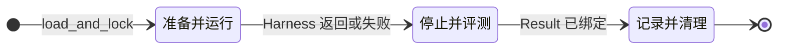

# Runtime — Lifecycle（Run / Trial / Attempt）

| 字段 | 值 |
| --- | --- |
| 父索引 | [05-runtime/README.md](README.md) |

---

## Run Coordinator

Run Coordinator 拥有外层状态机：

```text
Prepare: load_and_lock → Provider / Environment → Harness
Evaluate: stop writers → materialize allowlisted inputs → Evaluator
Finish: bind flat Result → record evidence → cleanup
```

Coordinator 只观察阶段结果。它**不**解析 Harness 内部业务 messages，也**不**要求拦截每一个本地 Tool call。  
但它**必须**保证：经 Agent Service 的每次 invocation、Runtime 边界上的关键 effect 摘要、以及 evaluation/cleanup 事实，在 Attempt evidence 目录中可定位（见 [evidence.md](evidence.md)）。

## 身份层次

```text
Run
└── Trial
    └── Attempt
        ├── Harness invocation
        ├── Agent invocations
        ├── Environment binding
        ├── Artifact outputs
        ├── Evaluation
        └── Cleanup
```

- retry / 重跑 → **新 Attempt**，不静默改写旧 Attempt identity；
- Campaign 只调度 Trial，不与 Attempt 内 workflow scheduler 合并。

## 三段执行路径

| 阶段 | 必做动作 | 可选策略 |
| --- | --- | --- |
| Prepare + Run | `load_and_lock()`、创建 Attempt、准备 Provider/Environment、注入 Capability、运行 Harness | reset、复杂 healthcheck、upstream process bridge |
| Stop + Evaluate | 关闭 Harness Capability、停止 writers、materialize allowlisted inputs、运行独立 Evaluator | Artifact digest/副本、Environment freeze/getter/snapshot、clean evaluator container |
| Record + cleanup | 绑定扁平 Result、**落盘 Agent 轨迹与 Attempt evidence 树**、teardown Provider/Environment | 归档 raw output、保留失败现场、资源复用判定；轨迹契约见 [evidence.md](evidence.md) |

## 外层状态机



Attempt 细化状态（实现可微调枚举名，语义固定）：

```text
created
  → preparing      # Provider + resources
  → running_harness
  → harness_terminal
  → sealing_inputs # stop writers + materialize
  → evaluating
  → binding_result
  → cleaning_up
  → terminal       # succeeded | failed | cancelled | …
```

## 阶段耗时（观测，#47 D）

Runtime 在 Attempt 边界记录标准阶段墙钟，写入 `result.json` 的 `phase_timing`（schema `bora.phase_timing/1`）：

| 阶段 id | 含义（展示标签可映射） |
| --- | --- |
| `prepare` | lock / Provider / Environment 准备 |
| `run` | Harness / Agent 执行 |
| `evaluate` | barrier 后独立评测 |
| `cleanup` | teardown / 收尾 |

- 服务 suite 进度、Viewer/Hub Timing 条与 job 复盘；**不**参与 PASS 判定。  
- L0 与 L1 SDK 路径均应落盘；缺字段时 UI 可不渲染 Timing，禁止用假数据回填。

## 不变量

1. `LockedTaskConfig` 在 Attempt 前形成，运行中不热更新；
2. Evaluator 启动前所有 writer 已停止，输入只来自 `evaluation.inputs`；
3. score 由独立 Evaluator 形成；`HarnessTerminal.completed` **≠** PASS；
4. cleanup failure 记录为 warning，不撤销已形成的 score；
5. 未 `load_and_lock` 成功不得启动 harness。
